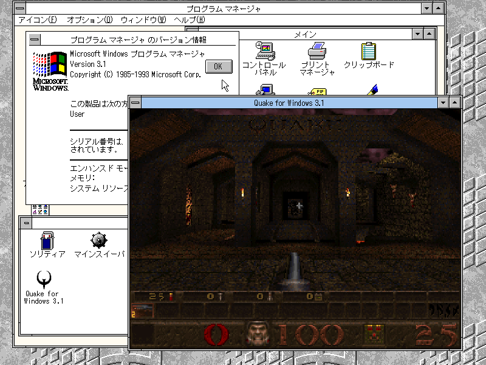

# Quake for Windows 3.1

笑ってQuake

## 仕様
- グラフィックランタイム「WinG」必須。使用ゲームを既にインストールしている環境ならそのまま遊べますが、無い場合は別途インストール必要あり。今でもVectorなどで配布されてます。仮にVectorが消えても使用ゲームに同梱して配布する場合に限り一部ファイルを再配布可能なようなのでその時は同梱します。
- FPUを搭載したCPU(Pentium以上推奨)、メモリ16MB（空きメモリが無い場合は起動しません）、色数32768色以上の画面モード必須。
- サウンド出力にも対応(ステレオ・モノラル)してますが、Windows 3.1の仕様上、別にサウンド再生しているアプリ、またはシステム音が流れている状態でQuakeを起動するとPCMデバイスがあってもサウンドが鳴りません。
- マウス操作可能。実行ファイルに同梱しているidフォルダ内にあるautoexec.cfgをそのまま利用すればWASD移動 & マウスルックが可能となります。マウス操作にするにはゲーム画面上で右クリック、再度右クリックすればまたWindowsにカーソルが戻ります。代わりにこの仕様のため右クリックに何が操作キーを割り当てることは不可能です。
- セーブ & ロード可能
- DOSBox-X環境にインストールしたIBM 日本語版 Windows 3.1、津軽エミュレータ上のFM TOWNS版Windows 3.1でハイレゾCRTC & FMT-3631(Power9000)で動作確認を行いましたが、DOSBox-X環境だと何故か5回ほど再起動をかけると保護違反エラーとなり起動しなくなります。FM TOWNS版Windows 3.1では何度再起動かけても問題ないので、PCエミュではなくDOSエミュというDOSBoxの仕様上の問題かと思いますが、誰か実環境のPC上でテストをお願いします。
- スペックが十分なのに動作がカクツク場合は「メイン」→「コントロールパネル」→「エンハンスドモード」からスワップファイルを無効化、「占有時間の単位」を3～4にしてください。Windows 3.1は時間単位でタスクを処理するノンプリエンプティブ・マルチタスクになっており、デフォルトの20(ms)だと高速なCPUでは長すぎます。

## License

Copyright (C) 1996-1997 Id Software, Inc.

This program is free software; you can redistribute it and/or
modify it under the terms of the GNU General Public License
as published by the Free Software Foundation; either version 2
of the License, or (at your option) any later version.

This program is distributed in the hope that it will be useful,
but WITHOUT ANY WARRANTY; without even the implied warranty of
MERCHANTABILITY or FITNESS FOR A PARTICULAR PURPOSE.  

See the GNU General Public License for more details.

You should have received a copy of the GNU General Public License
along with this program; if not, write to the Free Software
Foundation, Inc., 59 Temple Place - Suite 330, Boston, MA  02111-1307, USA.
